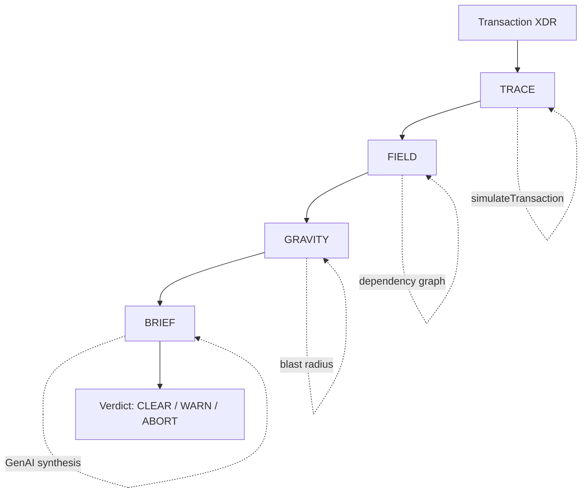

# MERIDIAN

**Pre-execution intelligence for Stellar developers. Know what crosses before it does.**

[](#license)
[](#requirements)
[](https://www.npmjs.com/package/meridian-core)

MERIDIAN sits between a developer's code and the Stellar network. Before any transaction submits, it simulates end-to-end, maps every contract it touches downstream, scores what breaks if something goes wrong, and returns a plain-language GenAI risk brief — all in one API call or CLI command.

---

## Table of Contents

- [How It Works](#how-it-works)
- [Verdict States](#verdict-states)
- [Requirements](#requirements)
- [Installation](#installation)
- [CLI Usage](#cli-usage)
  - [Commands](#commands)
  - [Options](#options)
  - [Examples](#examples)
  - [Ecosystem Manifest](#ecosystem-manifest)
- [REST API](#rest-api)
- [Environment Variables](#environment-variables)
- [Monorepo Structure](#monorepo-structure)
- [Development](#development)
- [Roadmap](#roadmap)
- [License](#license)

---

## How It Works



| Layer | Package | What it does |
|---|---|---|
| **TRACE** | `@meridian/core` | Simulates the transaction against Soroban RPC, parses the execution path, auth entries, fee estimate, and resource usage |
| **FIELD** | `@meridian/core` | Maps every contract touched, directly or downstream, and cross-references it against an optional ecosystem manifest |
| **GRAVITY** | `@meridian/core` | Scores the blast radius — which contracts and how many users are affected if the transaction fails |
| **BRIEF** | `@meridian/ai` | Synthesizes a grounded, plain-language risk briefing via Claude (with a deterministic fallback if no API key is set) |

## Verdict States

| Verdict | Meaning |
|---|---|
| 🟢 `CLEAR` | Safe to submit |
| 🟡 `WARN`  | Submit with caution — review warnings |
| 🔴 `ABORT` | Do not submit — critical failure predicted |

## Requirements

- Node.js **>= 20**
- A Soroban RPC endpoint for the network you're targeting (testnet/mainnet)
- *(Optional)* An [Anthropic API key](https://console.anthropic.com/) for GenAI-synthesized briefs — MERIDIAN falls back to a deterministic brief without one

## Installation

### CLI (recommended for most users)

```bash
npm install -g meridian-core
meridian-core --help
```

This installs both the `meridian` and `meridian-core` binaries.

### From source (monorepo development)

```bash
git clone https://github.com/armlynobinguar/meridian-core.git
cd meridian-core

# Install dependencies for every package
npm install

# Copy environment config
cp .env.example .env

# Build all packages
npm run build

# Run the full test suite
npm test
```

## CLI Usage

`meridian-core` runs the full TRACE → FIELD → GRAVITY → BRIEF pipeline — or any individual layer — directly from your terminal.

### Commands

| Command | Description |
|---|---|
| `meridian analyze [tx]` | Full pipeline: TRACE + FIELD + GRAVITY + BRIEF *(default command)* |
| `meridian trace [tx]` | TRACE only — simulate and report the execution path |
| `meridian field [tx]` | TRACE + FIELD — map the dependency graph touched by the transaction |
| `meridian gravity [tx]` | TRACE + FIELD + GRAVITY — score the blast radius |
| `meridian version` | Print CLI and engine version |
| `meridian --help` / `meridian <command> --help` | Show detailed help |

`tx` is the base64-encoded transaction XDR. It can be passed as an argument, via `--file`, or piped over stdin — see [Examples](#examples).

### Options

| Flag | Applies to | Description |
|---|---|---|
| `-n, --network <network>` | all | `mainnet` or `testnet` (default: `testnet`) |
| `--rpc-url <url>` | all | Override the Soroban RPC endpoint instead of reading it from env |
| `-f, --file <path>` | all | Read the transaction XDR from a file instead of an argument |
| `-e, --ecosystem <path>` | `field`, `gravity`, `analyze` | Path to an [ecosystem manifest](#ecosystem-manifest) JSON file |
| `--json` | all | Print raw JSON instead of a formatted report |
| `--skip-field` | `analyze` | Skip the FIELD dependency-mapping layer |
| `--skip-gravity` | `analyze` | Skip the GRAVITY blast-radius layer |
| `--confidence-threshold <n>` | `analyze` | Minimum confidence (0–1) required for a `CLEAR` verdict |
| `--no-brief` | `analyze` | Skip GenAI BRIEF synthesis (structured layers only) |
| `--api-key <key>` | `analyze` | Anthropic API key for BRIEF synthesis (else read from env) |

### Examples

```bash
# Full analysis (default command — "analyze" can be omitted)
meridian analyze <base64-xdr> --network testnet

# Read the XDR from a file
meridian analyze --file tx.xdr --network mainnet

# Pipe it in via stdin
cat tx.xdr | meridian analyze --network testnet --json

# Override the RPC endpoint without setting env vars
meridian analyze <base64-xdr> --network testnet --rpc-url https://soroban-testnet.stellar.org

# Score blast radius against a known ecosystem manifest
meridian gravity <base64-xdr> --ecosystem manifest.json --network testnet

# Fast structured-only analysis (no GenAI call)
meridian analyze <base64-xdr> --network testnet --no-brief

# TRACE only, fastest path
meridian trace <base64-xdr> --network testnet

# Check installed versions
meridian version
```

### Ecosystem Manifest

An optional JSON file describing known contracts in your ecosystem, used by `field`, `gravity`, and `analyze` to enrich dependency mapping, blast-radius scoring, and affected-user counts:

```json
{
  "name": "my-ecosystem",
  "version": "1.0.0",
  "contracts": [
    {
      "name": "token-vault",
      "address": "CABC...XYZ",
      "network": "testnet",
      "dependencies": ["CDEF...UVW"],
      "active_users": 4200,
      "criticality": "HIGH"
    }
  ]
}
```

## REST API

`@meridian/api` exposes the same pipeline over HTTP (Hono server, default port `3000`):

```bash
npm run dev --workspace=@meridian/api
```

| Method | Endpoint | Description |
|---|---|---|
| `GET`  | `/v1/health` | Health check |
| `GET`  | `/v1/version` | Product and engine version |
| `POST` | `/v1/analyze` | Full TRACE + FIELD + GRAVITY + BRIEF analysis |
| `POST` | `/v1/trace` | TRACE only |
| `POST` | `/v1/field` | TRACE + FIELD |
| `POST` | `/v1/gravity` | TRACE + FIELD + GRAVITY |

```bash
# Health check
curl http://localhost:3000/v1/health

# Full analysis
curl -X POST http://localhost:3000/v1/analyze \
  -H "Content-Type: application/json" \
  -d '{"tx": "<base64-xdr>", "network": "testnet"}'
```

## Environment Variables

See [`.env.example`](.env.example) for the full template. Every variable can also be overridden per-CLI-invocation with `--rpc-url` / `--api-key`.

| Variable | Required | Description |
|---|---|---|
| `STELLAR_RPC_TESTNET` | For testnet use | Soroban RPC endpoint for testnet |
| `STELLAR_RPC_MAINNET` | For mainnet use | Soroban RPC endpoint for mainnet |
| `ANTHROPIC_API_KEY` | No | Claude API key for BRIEF synthesis — falls back to a deterministic brief if unset |
| `LOG_LEVEL` | No | `debug` \| `info` \| `warn` \| `error` (default: `info`) |
| `PORT` | No | API server port (default: `3000`) |

## Monorepo Structure

```
packages/
├── core/    TRACE + FIELD + GRAVITY engines
├── ai/      BRIEF GenAI synthesis (Claude)
├── api/     REST API server (Hono)
└── cli/     meridian / meridian-core command-line interface
```

Managed with npm workspaces and [Turborepo](https://turbo.build/).

## Development

```bash
# Build every package
npm run build

# Build a single package
npm run build --workspace=@meridian/core

# Run all tests
npm test

# Typecheck everything
npm run typecheck

# Watch mode for the API server
npm run dev --workspace=@meridian/api

# Watch mode for the CLI (runs from source via tsx, no build step)
npm run dev --workspace=meridian-core
```

Each package can also be built, tested, and typechecked independently from its own directory (`packages/core`, `packages/ai`, `packages/api`, `packages/cli`).

## Roadmap

**Phase 1 — Vertical Slice** *(current)*
- [x] `packages/core/trace` — simulateTransaction wrapper + XDR parser
- [x] `packages/ai/brief` — Claude API synthesis with fallback
- [x] `packages/api/` — POST /v1/analyze returning full response shape
- [x] `packages/cli/` — `meridian` / `meridian-core` command-line interface
- [ ] End-to-end validation with ScholarSeal canonical test case

## License

MIT
