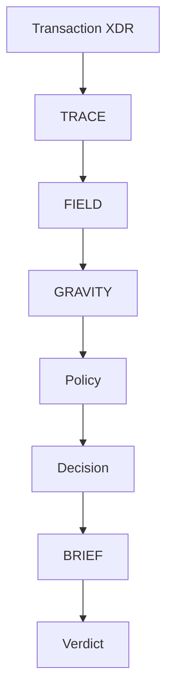

## Packages

| Package | Role |
|---|---|
| `@meridian/core` | TRACE, FIELD, GRAVITY, decision, policy, graph, diff |
| `@meridian/ai` | BRIEF GenAI synthesis |
| `@meridian/api` | REST API server (Hono) |
| `meridian-core` | CLI |
| `@meridian/stellar` | JavaScript SDK |
| `meridian-py` | Python SDK |

## Analysis flow

1. **TRACE** simulates the transaction, keeps simulation `results` when present, and may decode transfer-like diagnostic events into `token_events`.
2. **FIELD** maps contract dependencies via footprint, execution path, manifest BFS, and optional record-mode re-simulation. It fetches TTL metadata and WASM hashes for upgrade drift.
3. **GRAVITY** scores blast radius using evidence factors (including counterparty audit/upgradeable/reputation when manifesto-supplied) and assesses recovery (`FULL`, `PARTIAL`, `NONE`).
4. **Policy** (optional) evaluates deterministic rules (`unknown_contract`, `require_approval`, `max_amount`, …).
5. **Decision** chooses `submit` | `hold` | `rewrite` with top risks.
6. **BRIEF** synthesizes a grounded risk briefing via Claude (with deterministic fallback).

Execution graphs mark token edges as `classic`, `heuristic`, or `decoded`. Classic payment amounts parse from XDR descriptions; decoded amounts prefer simulation diagnostics when available.

## Batch analysis

`analyzeBatch` runs the structured pipeline (no BRIEF) across multiple transactions and returns per-item risk scores plus aggregate failure patterns.
