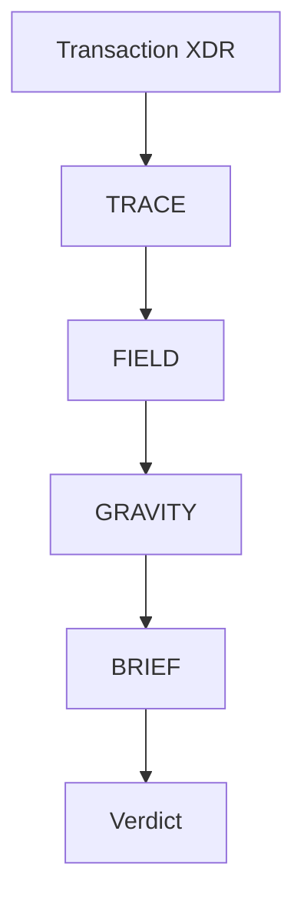

## Packages

| Package | Role |
|---|---|
| `@meridian/core` | TRACE, FIELD, GRAVITY engines |
| `@meridian/ai` | BRIEF GenAI synthesis |
| `@meridian/api` | REST API server (Hono) |
| `meridian-core` | CLI |
| `@meridian/stellar` | JavaScript SDK |
| `meridian-py` | Python SDK |

## Analysis flow

1. **TRACE** simulates the transaction with `enforce` auth mode and parses the execution path, footprint, and resource usage.
2. **FIELD** maps contract dependencies via footprint, execution path, manifest BFS, and optional record-mode re-simulation. It fetches TTL metadata via `getLedgerEntries`.
3. **GRAVITY** scores blast radius using 10 weighted evidence factors and assesses recovery (`FULL`, `PARTIAL`, `NONE`).
4. **BRIEF** synthesizes a grounded risk briefing via Claude (with deterministic fallback).

## Batch analysis

`analyzeBatch` runs the structured pipeline (no BRIEF) across multiple transactions and returns per-item risk scores plus aggregate failure patterns.
